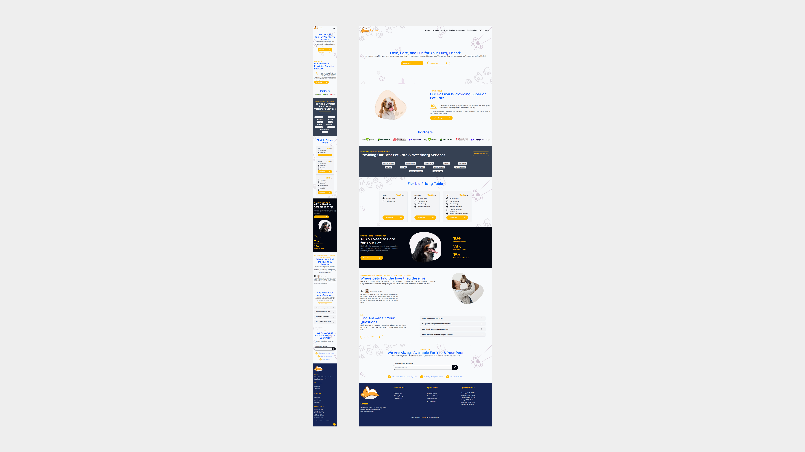
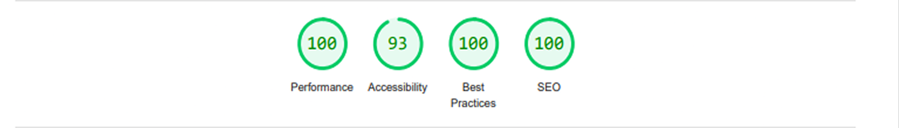

# Petzzo

Petzzo is a web application built as a landing page to promote and showcase services focused on pet care, wellness, and related products. Developed with React.js and TypeScript, the application is fully responsive and follows best practices in accessibility, performance, and code standardization.

## Project preview

**UI:**


**Deploy:**
Access the [deploy](https://igor-deploy-petzzo.vercel.app/) or copy the URL directly:

```
https://igor-deploy-petzzo.vercel.app/
```

---

## Project resources

**Main technologies:**

- HTML
- CSS, Tailwindcss
- JavaScript, TypeScript
- Reactjs
- React Hook Form, Yup
- Vite

**Development support:**

- Git
- Yarn Package Manager
- Eslint, Prettier, EditorConfig
- Lighthouse
- Vercel

**Extras:**

- Documentation
- Tests
- Conventional Commits
- Standardized code formatting
- Absolute imports
- Deploy on Vercel
- Mobile First
- Responsive UI
- SEO
- Lighthouse analysis result: 

## How to use

**Running app:**

- Clone this repository to your computer
- Install dependencies using the command: `yarn install`
- Start the development server with: `yarn dev`
- Open your browser and navigate to: `http://localhost:3000`
